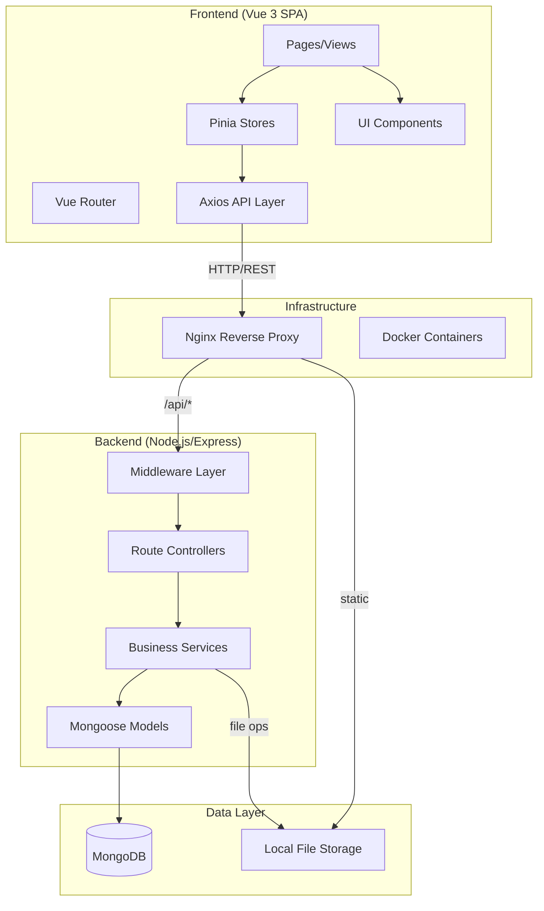
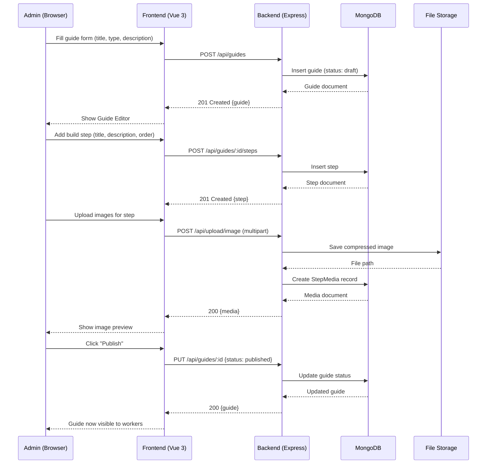
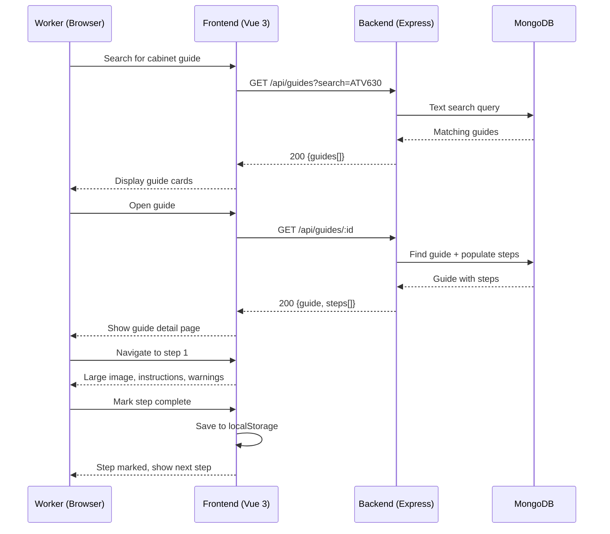

# Design Document: CabinetLog — Cabinet Assembly Platform

## Overview

CabinetLog is a web-based production knowledge platform for industrial electrical cabinet assembly. It enables experienced production workers (Admins) to create standardized, visual assembly guides for cabinet models — including VSD cabinets, industrial control cabinets, MCC sections, and custom electrical panels — so that other workers can follow them step-by-step during production.

The platform follows a classic three-tier architecture: a Vue 3 SPA frontend communicating via REST API with a Node.js/Express backend, backed by MongoDB for document storage and local filesystem for media assets. Authentication uses JWT tokens with role-based access control distinguishing Admin (create/edit/publish) and Worker (view/follow) capabilities.

The MVP prioritizes simplicity and visual-first UX — optimized for shop-floor use on phones, tablets, and desktops where workers need to quickly find a guide, view large images, and follow sequential build steps.

## Architecture



## Sequence Diagrams

### Admin: Create and Publish Guide



### Worker: Follow Assembly Guide




## Components and Interfaces

### Component 1: Authentication Module

**Purpose**: Handles user login, JWT token management, and role-based access control.

**Interface**:
```typescript
interface AuthService {
  login(email: string, password: string): Promise<AuthResponse>
  logout(): Promise<void>
  getCurrentUser(token: string): Promise<User>
  verifyToken(token: string): DecodedToken | null
  hashPassword(password: string): Promise<string>
  comparePassword(plain: string, hash: string): Promise<boolean>
}

interface AuthResponse {
  token: string
  user: UserPublic
}

interface DecodedToken {
  userId: string
  role: 'admin' | 'worker'
  iat: number
  exp: number
}
```

**Responsibilities**:
- Authenticate users via email/password
- Issue and verify JWT tokens
- Protect routes based on user role
- Hash and compare passwords using bcrypt

### Component 2: Guide Management Service

**Purpose**: CRUD operations for cabinet guides including status transitions and versioning.

**Interface**:
```typescript
interface GuideService {
  createGuide(data: CreateGuideDTO, userId: string): Promise<CabinetGuide>
  getGuides(filters: GuideFilters): Promise<PaginatedResult<CabinetGuide>>
  getGuideById(id: string): Promise<CabinetGuide | null>
  updateGuide(id: string, data: UpdateGuideDTO): Promise<CabinetGuide>
  deleteGuide(id: string): Promise<void>
  publishGuide(id: string): Promise<CabinetGuide>
  archiveGuide(id: string): Promise<CabinetGuide>
}

interface GuideFilters {
  search?: string
  cabinetType?: string
  driveModel?: string
  tags?: string[]
  status?: 'draft' | 'published' | 'archived'
  page?: number
  limit?: number
}

interface PaginatedResult<T> {
  data: T[]
  total: number
  page: number
  totalPages: number
}
```

**Responsibilities**:
- Create, read, update, delete cabinet guides
- Manage guide status transitions (draft → published → archived)
- Generate URL-friendly slugs from titles
- Apply search and filter queries
- Enforce business rules (only admins can create/edit)

### Component 3: Build Step Service

**Purpose**: Manages ordered build steps within a guide, including reordering logic.

**Interface**:
```typescript
interface StepService {
  createStep(guideId: string, data: CreateStepDTO): Promise<BuildStep>
  updateStep(stepId: string, data: UpdateStepDTO): Promise<BuildStep>
  deleteStep(stepId: string): Promise<void>
  reorderSteps(guideId: string, stepIds: string[]): Promise<BuildStep[]>
  getStepsByGuide(guideId: string): Promise<BuildStep[]>
}

interface CreateStepDTO {
  title: string
  description: string
  step_order: number
  estimated_time?: number
  warning_notes?: string
}
```

**Responsibilities**:
- Add/edit/remove build steps for a guide
- Maintain step ordering (reorder on insert/delete)
- Cascade delete associated media when step is removed
- Validate step belongs to specified guide

### Component 4: File Upload Service

**Purpose**: Handles image and PDF uploads with validation, compression, and storage.

**Interface**:
```typescript
interface UploadService {
  uploadImage(file: Express.Multer.File): Promise<StepMedia>
  uploadPDF(file: Express.Multer.File): Promise<StepMedia>
  deleteFile(filePath: string): Promise<void>
  validateFile(file: Express.Multer.File, type: 'image' | 'pdf'): ValidationResult
  compressImage(inputPath: string, outputPath: string): Promise<string>
}

interface ValidationResult {
  valid: boolean
  error?: string
}

const FILE_CONSTRAINTS = {
  image: {
    maxSize: 10 * 1024 * 1024, // 10MB
    allowedTypes: ['image/jpeg', 'image/png'],
    extensions: ['.jpg', '.jpeg', '.png']
  },
  pdf: {
    maxSize: 25 * 1024 * 1024, // 25MB
    allowedTypes: ['application/pdf'],
    extensions: ['.pdf']
  }
}
```

**Responsibilities**:
- Accept multipart file uploads
- Validate file type, size, and extension
- Compress images for web delivery
- Store files in organized directory structure
- Generate unique filenames to prevent collisions
- Clean up orphaned files on deletion

### Component 5: Search Service

**Purpose**: Provides fast, typo-tolerant search across guides.

**Interface**:
```typescript
interface SearchService {
  searchGuides(query: string, filters?: SearchFilters): Promise<CabinetGuide[]>
  buildSearchIndex(): Promise<void>
}

interface SearchFilters {
  cabinetType?: string
  driveModel?: string
  tags?: string[]
  status?: 'published'
}
```

**Responsibilities**:
- Full-text search on guide title, description, drive model
- Tag-based filtering
- MongoDB text index for typo tolerance
- Return results ranked by relevance


## Data Models

### Model 1: User

```typescript
interface User {
  _id: ObjectId
  name: string
  email: string
  password_hash: string
  role: 'admin' | 'worker'
  created_at: Date
}
```

**Validation Rules**:
- `email` must be unique and valid email format
- `password_hash` generated from minimum 8-character password
- `role` defaults to 'worker'
- `name` required, 2-100 characters

### Model 2: CabinetGuide

```typescript
interface CabinetGuide {
  _id: ObjectId
  title: string
  slug: string
  cabinet_type: string
  drive_model: string
  description: string
  thumbnail_image?: string
  status: 'draft' | 'published' | 'archived'
  version: number
  tags: ObjectId[]
  created_by: ObjectId
  created_at: Date
  updated_at: Date
}
```

**Validation Rules**:
- `title` required, 3-200 characters
- `slug` auto-generated from title, must be unique
- `cabinet_type` required (e.g., "VSD", "MCC", "Control Panel", "Custom")
- `status` defaults to 'draft'
- `version` starts at 1, increments on publish
- `created_by` must reference valid User with admin role

### Model 3: BuildStep

```typescript
interface BuildStep {
  _id: ObjectId
  cabinet_guide_id: ObjectId
  title: string
  description: string
  step_order: number
  estimated_time?: number  // minutes
  warning_notes?: string
  created_at: Date
}
```

**Validation Rules**:
- `cabinet_guide_id` must reference existing guide
- `title` required, 3-200 characters
- `step_order` must be positive integer, unique within guide
- `estimated_time` if provided, must be positive number
- `warning_notes` optional, max 1000 characters

### Model 4: StepMedia

```typescript
interface StepMedia {
  _id: ObjectId
  build_step_id: ObjectId
  file_type: 'image' | 'pdf'
  file_path: string
  original_name: string
  file_size: number
  caption?: string
  sort_order: number
  created_at: Date
}
```

**Validation Rules**:
- `build_step_id` must reference existing step
- `file_path` must point to existing file on disk
- `file_type` determined from MIME type validation
- `file_size` must not exceed type-specific limits
- `sort_order` determines display order within step

### Model 5: Tag

```typescript
interface Tag {
  _id: ObjectId
  name: string
  created_at: Date
}
```

**Validation Rules**:
- `name` required, unique, 1-50 characters
- Case-insensitive uniqueness (stored lowercase)

## Algorithmic Pseudocode

### Guide Search Algorithm

```typescript
/**
 * ALGORITHM: searchGuides
 * INPUT: query string, optional filters
 * OUTPUT: array of matching guides sorted by relevance
 *
 * Uses MongoDB text index for full-text search with
 * additional filter criteria applied as query conditions.
 */
async function searchGuides(query: string, filters: SearchFilters): Promise<CabinetGuide[]> {
  // Step 1: Build base query with text search
  const searchQuery: any = {}

  if (query && query.trim().length > 0) {
    searchQuery.$text = { $search: query }
  }

  // Step 2: Apply filters
  if (filters.cabinetType) {
    searchQuery.cabinet_type = filters.cabinetType
  }
  if (filters.driveModel) {
    searchQuery.drive_model = new RegExp(filters.driveModel, 'i')
  }
  if (filters.tags && filters.tags.length > 0) {
    searchQuery.tags = { $in: filters.tags }
  }
  if (filters.status) {
    searchQuery.status = filters.status
  }

  // Step 3: Execute query with relevance scoring
  const results = await CabinetGuideModel
    .find(searchQuery)
    .select({ score: { $meta: 'textScore' } })
    .sort({ score: { $meta: 'textScore' } })
    .populate('tags', 'name')
    .populate('created_by', 'name')
    .lean()

  return results
}
```

**Preconditions:**
- MongoDB text index exists on `title`, `description`, `drive_model`, `cabinet_type`
- `filters.status` if provided is one of: 'draft', 'published', 'archived'
- `filters.tags` if provided contains valid ObjectId strings

**Postconditions:**
- Returns array of guides matching query and filters
- Results sorted by text relevance score (highest first)
- Empty array returned if no matches (never throws for valid input)

### Step Reordering Algorithm

```typescript
/**
 * ALGORITHM: reorderSteps
 * INPUT: guideId, ordered array of step IDs representing new order
 * OUTPUT: updated steps with corrected step_order values
 *
 * Atomically reorders all steps in a guide to match the
 * provided ID sequence. Uses bulkWrite for efficiency.
 */
async function reorderSteps(guideId: string, stepIds: string[]): Promise<BuildStep[]> {
  // Step 1: Validate all step IDs belong to this guide
  const existingSteps = await BuildStepModel.find({ cabinet_guide_id: guideId })
  const existingIds = new Set(existingSteps.map(s => s._id.toString()))

  for (const id of stepIds) {
    if (!existingIds.has(id)) {
      throw new Error(`Step ${id} does not belong to guide ${guideId}`)
    }
  }

  if (stepIds.length !== existingSteps.length) {
    throw new Error('stepIds must include all steps in the guide')
  }

  // Step 2: Build bulk update operations
  const operations = stepIds.map((stepId, index) => ({
    updateOne: {
      filter: { _id: stepId },
      update: { $set: { step_order: index + 1 } }
    }
  }))

  // Step 3: Execute atomic bulk write
  await BuildStepModel.bulkWrite(operations)

  // Step 4: Return updated steps in new order
  return BuildStepModel
    .find({ cabinet_guide_id: guideId })
    .sort({ step_order: 1 })
    .lean()
}
```

**Preconditions:**
- `guideId` references an existing guide
- `stepIds` is a permutation of all step IDs belonging to the guide
- No duplicate IDs in `stepIds`

**Postconditions:**
- All steps have `step_order` values from 1 to N (no gaps)
- Step order matches the sequence in `stepIds`
- No steps are added or removed
- Operation is atomic (all-or-nothing via bulkWrite)

**Loop Invariants:**
- For the validation loop: all previously checked IDs exist in `existingIds`
- For the operations map: `index + 1` produces sequential order starting at 1


### Image Upload and Compression Algorithm

```typescript
/**
 * ALGORITHM: uploadImage
 * INPUT: multipart file from HTTP request
 * OUTPUT: StepMedia document with file path
 *
 * Validates, compresses, stores, and records an uploaded image.
 */
async function uploadImage(file: Express.Multer.File): Promise<StepMedia> {
  // Step 1: Validate file
  const validation = validateFile(file, 'image')
  if (!validation.valid) {
    throw new ValidationError(validation.error)
  }

  // Step 2: Generate unique filename
  const ext = path.extname(file.originalname).toLowerCase()
  const filename = `${uuidv4()}${ext}`
  const uploadDir = path.join(UPLOAD_ROOT, 'images', getDateFolder())
  await fs.mkdir(uploadDir, { recursive: true })

  // Step 3: Compress image
  const outputPath = path.join(uploadDir, filename)
  await sharp(file.buffer)
    .resize(1920, 1920, { fit: 'inside', withoutEnlargement: true })
    .jpeg({ quality: 80 })
    .toFile(outputPath)

  // Step 4: Create media record
  const media = await StepMediaModel.create({
    file_type: 'image',
    file_path: path.relative(UPLOAD_ROOT, outputPath),
    original_name: file.originalname,
    file_size: (await fs.stat(outputPath)).size,
    sort_order: 0,
    created_at: new Date()
  })

  return media
}
```

**Preconditions:**
- `file` is a valid Multer file object with buffer, originalname, mimetype
- `UPLOAD_ROOT` directory exists and is writable
- `sharp` library is available for image processing

**Postconditions:**
- Image is resized to max 1920x1920 maintaining aspect ratio
- Image is compressed to JPEG quality 80
- File is stored with UUID filename (no collisions)
- StepMedia document created in database
- Original file buffer is not persisted (only compressed version)

### Guide Status Transition Algorithm

```typescript
/**
 * ALGORITHM: transitionGuideStatus
 * INPUT: guide ID, target status
 * OUTPUT: updated guide document
 *
 * Enforces valid state transitions:
 *   draft → published
 *   published → archived
 *   archived → draft (re-open)
 *   draft → archived (discard)
 */
const VALID_TRANSITIONS: Record<string, string[]> = {
  draft: ['published', 'archived'],
  published: ['archived'],
  archived: ['draft']
}

async function transitionGuideStatus(
  guideId: string,
  targetStatus: string
): Promise<CabinetGuide> {
  // Step 1: Fetch current guide
  const guide = await CabinetGuideModel.findById(guideId)
  if (!guide) {
    throw new NotFoundError('Guide not found')
  }

  // Step 2: Validate transition
  const allowedTargets = VALID_TRANSITIONS[guide.status]
  if (!allowedTargets || !allowedTargets.includes(targetStatus)) {
    throw new ValidationError(
      `Cannot transition from '${guide.status}' to '${targetStatus}'`
    )
  }

  // Step 3: Apply business rules for publishing
  if (targetStatus === 'published') {
    const stepCount = await BuildStepModel.countDocuments({
      cabinet_guide_id: guideId
    })
    if (stepCount === 0) {
      throw new ValidationError('Cannot publish guide with no build steps')
    }
    guide.version += 1
  }

  // Step 4: Update status
  guide.status = targetStatus
  guide.updated_at = new Date()
  await guide.save()

  return guide
}
```

**Preconditions:**
- `guideId` is a valid ObjectId string
- `targetStatus` is one of: 'draft', 'published', 'archived'
- Caller has admin role (enforced by middleware)

**Postconditions:**
- Guide status is updated to `targetStatus`
- If publishing: version is incremented, guide has at least 1 step
- If invalid transition: error thrown, no state change
- `updated_at` timestamp is refreshed

## Key Functions with Formal Specifications

### Authentication Middleware

```typescript
/**
 * Express middleware that extracts and verifies JWT from Authorization header.
 * Attaches decoded user to request object for downstream handlers.
 */
function authMiddleware(req: Request, res: Response, next: NextFunction): void
```

**Preconditions:**
- Request may or may not contain `Authorization` header
- JWT_SECRET environment variable is set

**Postconditions:**
- If valid token: `req.user` is set with `{ userId, role }`, calls `next()`
- If missing/invalid token: responds with 401 Unauthorized, does not call `next()`
- Never modifies request body or query parameters

### Role Guard Middleware

```typescript
/**
 * Factory function that creates middleware restricting access to specified roles.
 */
function requireRole(...roles: string[]): RequestHandler
```

**Preconditions:**
- `authMiddleware` has already run (req.user is populated)
- `roles` contains at least one valid role string

**Postconditions:**
- If `req.user.role` is in `roles`: calls `next()`
- If not: responds with 403 Forbidden
- Does not modify request state

### Slug Generation

```typescript
/**
 * Generates a URL-friendly slug from a guide title.
 * Ensures uniqueness by appending numeric suffix if needed.
 */
async function generateUniqueSlug(title: string): Promise<string>
```

**Preconditions:**
- `title` is a non-empty string
- Database connection is active

**Postconditions:**
- Returns lowercase, hyphenated string (only a-z, 0-9, hyphens)
- Slug is unique across all guides in database
- If base slug exists, appends `-2`, `-3`, etc.
- Maximum length: 200 characters

### File Validation

```typescript
/**
 * Validates uploaded file against type-specific constraints.
 */
function validateFile(
  file: Express.Multer.File,
  type: 'image' | 'pdf'
): ValidationResult
```

**Preconditions:**
- `file` has `mimetype`, `size`, and `originalname` properties
- `type` is either 'image' or 'pdf'

**Postconditions:**
- Returns `{ valid: true }` if file passes all checks
- Returns `{ valid: false, error: string }` if any check fails
- Checks performed: MIME type whitelist, file extension, file size limit
- No side effects (pure validation function)

## Example Usage

```typescript
// Example 1: Admin creates a new guide
const guide = await guideService.createGuide({
  title: 'ATV630 VSD Cabinet Assembly',
  cabinet_type: 'VSD',
  drive_model: 'ATV630',
  description: 'Step-by-step assembly guide for ATV630 variable speed drive cabinets',
  tags: ['atv630', 'vsd', 'water-cooling']
}, adminUser._id)

// Example 2: Admin adds a build step with image
const step = await stepService.createStep(guide._id, {
  title: 'Mount DIN Rails',
  description: 'Install 3x DIN rails at positions marked on backplate',
  step_order: 1,
  estimated_time: 15,
  warning_notes: 'Ensure rails are level before tightening'
})

const media = await uploadService.uploadImage(imageFile)
await StepMediaModel.findByIdAndUpdate(media._id, {
  build_step_id: step._id,
  caption: 'DIN rail positioning reference'
})

// Example 3: Worker searches for a guide
const results = await searchService.searchGuides('ATV630 water cooling', {
  status: 'published',
  cabinetType: 'VSD'
})

// Example 4: Admin publishes guide
const published = await transitionGuideStatus(guide._id, 'published')
// published.version === 2, published.status === 'published'

// Example 5: Frontend - Vue composable for guide steps
// composables/useGuideSteps.ts
export function useGuideSteps(guideId: string) {
  const steps = ref<BuildStep[]>([])
  const currentStep = ref(0)
  const completedSteps = ref<Set<string>>(new Set())

  // Load from localStorage
  const storageKey = `guide-progress-${guideId}`
  const saved = localStorage.getItem(storageKey)
  if (saved) {
    completedSteps.value = new Set(JSON.parse(saved))
  }

  function markComplete(stepId: string) {
    completedSteps.value.add(stepId)
    localStorage.setItem(storageKey, JSON.stringify([...completedSteps.value]))
  }

  function nextStep() {
    if (currentStep.value < steps.value.length - 1) {
      currentStep.value++
    }
  }

  function prevStep() {
    if (currentStep.value > 0) {
      currentStep.value--
    }
  }

  return { steps, currentStep, completedSteps, markComplete, nextStep, prevStep }
}
```


## Correctness Properties

*A property is a characteristic or behavior that should hold true across all valid executions of a system — essentially, a formal statement about what the system should do. Properties serve as the bridge between human-readable specifications and machine-verifiable correctness guarantees.*

### Property 1: Guide Status Transition Integrity

*For any* guide in any status, only the transitions defined in the VALID_TRANSITIONS map (draft→published, draft→archived, published→archived, archived→draft) SHALL succeed, and any other transition attempt SHALL leave the guide unchanged.

**Validates: Requirements 4.1, 4.2**

### Property 2: Published Guide Non-Empty

*For any* guide, publishing SHALL only succeed when the guide contains at least one build step, and the version number SHALL increment by exactly one on each publish transition.

**Validates: Requirements 4.3, 4.4**

### Property 3: Version Monotonicity

*For any* sequence of operations on a guide, the version number SHALL only increase (on publish transitions) and never decrease regardless of other status transitions.

**Validates: Requirements 4.6**

### Property 4: Step Order Contiguity After Reorder

*For any* guide and any valid permutation of its step IDs, after reordering, the step_order values SHALL form a contiguous sequence [1, 2, ..., N] with no gaps and no duplicates.

**Validates: Requirements 5.1, 5.2**

### Property 5: Step Reorder Validation

*For any* reorder request where the provided step IDs are not an exact permutation of all steps in the guide (missing IDs, extra IDs, or IDs from other guides), the Step_Service SHALL reject the request and leave all step_order values unchanged.

**Validates: Requirements 5.3, 5.7**

### Property 6: Role Authorization

*For any* mutation request (create, update, delete) on any protected resource, the System SHALL allow the operation only when the authenticated user has the 'admin' role, and SHALL return 403 Forbidden for users with the 'worker' role.

**Validates: Requirements 2.1, 2.2**

### Property 7: File Validation

*For any* uploaded file, the Upload_Service SHALL reject it when the MIME type is not in the allowed set for its category (image/jpeg, image/png for images; application/pdf for PDFs) OR when the file size exceeds the type-specific limit (10 MB for images, 25 MB for PDFs).

**Validates: Requirements 6.1, 6.2, 6.3, 6.4**

### Property 8: File Type Consistency

*For any* stored StepMedia record, the file_type field SHALL be 'image' if and only if the file extension is .jpg, .jpeg, or .png, and 'pdf' if and only if the extension is .pdf.

**Validates: Requirements 6.8**

### Property 9: Slug Validity and Uniqueness

*For any* guide title, the generated slug SHALL contain only lowercase letters (a-z), digits (0-9), and hyphens, and SHALL be unique across all guides in the database (appending numeric suffixes when necessary).

**Validates: Requirements 3.2, 3.3, 3.4**

### Property 10: Cascade Deletion

*For any* deleted guide, all associated build steps, their Step_Media records, and the corresponding files on the filesystem SHALL also be deleted, leaving no orphaned records or files.

**Validates: Requirements 9.1, 9.2, 9.3, 5.4**

### Property 11: JWT Token Integrity

*For any* issued JWT token, decoding it SHALL reveal the userId and role of the authenticated user, and the token expiration SHALL be set to 8 hours from issuance.

**Validates: Requirements 1.4, 1.6**

### Property 12: Invalid Token Rejection

*For any* expired, malformed, or tampered JWT token, the Auth_Module SHALL reject the request with a 401 Unauthorized response.

**Validates: Requirements 1.5, 2.3**

### Property 13: Search Result Filtering for Workers

*For any* search query executed by a Worker, the results SHALL contain only guides with status 'published' — no draft or archived guides SHALL appear.

**Validates: Requirements 7.4**

### Property 14: Search Result Relevance Ordering

*For any* search query returning multiple results, the results SHALL be sorted by text relevance score in non-increasing order.

**Validates: Requirements 7.2**

### Property 15: Image Compression Bounds

*For any* valid uploaded image, after compression the output dimensions SHALL not exceed 1920x1920 pixels, the aspect ratio SHALL be maintained, and the original image SHALL not be enlarged.

**Validates: Requirements 6.5**

### Property 16: UUID Filename Generation

*For any* uploaded file, the stored filename SHALL be a UUID-based name (not the user-provided filename), ensuring no path traversal is possible and no filename collisions occur.

**Validates: Requirements 6.6, 11.4**

### Property 17: Progress Persistence Round-Trip

*For any* Worker's step completion state saved to localStorage, returning to the same guide SHALL restore the exact same set of completed steps.

**Validates: Requirements 10.2, 10.3**

### Property 18: Title Length Validation

*For any* string shorter than 3 characters or longer than 200 characters, the Guide_Service and Step_Service SHALL reject it as an invalid title.

**Validates: Requirements 3.6, 5.5**

### Property 19: Pagination Consistency

*For any* paginated guide list response, the total count, current page, and total pages SHALL be mathematically consistent (totalPages = ceil(total / limit)), and the returned data subset SHALL correspond to the requested page.

**Validates: Requirements 8.2, 8.3**

### Property 20: Password Hashing

*For any* password provided during registration, the Auth_Module SHALL store a bcrypt hash (never plaintext), and comparing the original password against the hash SHALL succeed.

**Validates: Requirements 1.3**

## Error Handling

### Error Scenario 1: Invalid File Upload

**Condition**: User uploads file exceeding size limit or with disallowed MIME type
**Response**: Return 400 with descriptive error message; do not store file
**Recovery**: Frontend shows inline error, user can retry with valid file

### Error Scenario 2: Concurrent Step Reordering

**Condition**: Two admins reorder steps simultaneously on same guide
**Response**: Last write wins (MongoDB atomic bulkWrite); no data corruption
**Recovery**: Frontend refreshes step list after reorder to show current state

### Error Scenario 3: Guide Publish Without Steps

**Condition**: Admin attempts to publish a guide with zero build steps
**Response**: Return 422 with message "Cannot publish guide with no build steps"
**Recovery**: Frontend shows validation error, admin must add at least one step

### Error Scenario 4: Expired JWT Token

**Condition**: User's token expires during session
**Response**: Return 401 on next API call; frontend interceptor catches it
**Recovery**: Redirect to login page; preserve current URL for post-login redirect

### Error Scenario 5: File Storage Failure

**Condition**: Disk full or write permission error during upload
**Response**: Return 500 with generic error; log detailed error server-side
**Recovery**: No partial file left on disk (cleanup in catch block); user retries upload

### Error Scenario 6: Duplicate Slug

**Condition**: Two guides created with same title simultaneously
**Response**: `generateUniqueSlug` appends numeric suffix; MongoDB unique index as safety net
**Recovery**: If unique index violation occurs, retry slug generation with incremented suffix

## Testing Strategy

### Unit Testing Approach

**Framework**: Jest (backend), Vitest (frontend)

Key unit test areas:
- Slug generation (various titles, special characters, duplicates)
- File validation (valid/invalid types, boundary sizes)
- Status transition logic (all valid/invalid transitions)
- Step reordering (permutations, edge cases)
- JWT token creation and verification
- Search query building

### Property-Based Testing Approach

**Property Test Library**: fast-check

Properties to test:
- `generateUniqueSlug` always produces valid URL characters (a-z, 0-9, hyphens)
- Step reordering with any permutation of IDs produces contiguous 1..N ordering
- File validation rejects any file with size > limit regardless of other properties
- Status transitions: no sequence of valid transitions can reach an invalid state
- Search results for published guides never include draft/archived guides (for worker role)

### Integration Testing Approach

**Framework**: Supertest + MongoDB Memory Server

Key integration tests:
- Full guide lifecycle: create → add steps → upload media → publish → archive
- Authentication flow: login → access protected route → token expiry → re-login
- Search accuracy: create guides with known content → verify search returns correct results
- File upload pipeline: upload → verify compression → verify storage → verify retrieval
- Cascade deletion: delete guide → verify steps and media removed

## Performance Considerations

- **Image Compression**: All uploaded images resized to max 1920px and compressed to JPEG quality 80, reducing bandwidth for mobile workers on shop floor
- **Lazy Loading**: Guide list page loads thumbnails lazily; step images load on scroll into viewport
- **MongoDB Indexes**: Text index on (title, description, drive_model, cabinet_type); compound index on (cabinet_guide_id, step_order) for step queries; unique index on slug
- **Pagination**: Guide list API returns paginated results (default 20 per page) to avoid loading entire collection
- **Static File Serving**: Nginx serves uploaded files directly (bypasses Node.js for media requests)
- **Auto-save**: Guide editor debounces saves (2-second delay) to reduce API calls during editing

## Security Considerations

- **Password Hashing**: bcrypt with cost factor 12; never store or log plaintext passwords
- **JWT Configuration**: Tokens expire after 8 hours; signed with HS256; secret from environment variable
- **File Upload Security**: Validate MIME type server-side (don't trust Content-Type header); scan file magic bytes; reject executable content
- **Input Sanitization**: All user input sanitized before database queries; use Mongoose schema validation
- **Rate Limiting**: Login endpoint limited to 5 attempts per minute per IP; upload endpoint limited to 10 files per minute
- **CORS**: Restrict to known frontend origin in production
- **File Path Traversal**: Uploaded filenames replaced with UUIDs; never use user-provided filenames in file paths
- **Role Enforcement**: All mutation endpoints check admin role server-side (never trust frontend-only checks)

## Dependencies

### Backend
| Package | Purpose |
|---------|---------|
| express | HTTP server framework |
| mongoose | MongoDB ODM |
| jsonwebtoken | JWT creation/verification |
| bcryptjs | Password hashing |
| multer | Multipart file upload handling |
| sharp | Image compression/resizing |
| uuid | Unique filename generation |
| cors | Cross-origin resource sharing |
| helmet | Security headers |
| express-rate-limit | Rate limiting |
| dotenv | Environment configuration |

### Frontend
| Package | Purpose |
|---------|---------|
| vue | UI framework (v3, Composition API) |
| vue-router | Client-side routing |
| pinia | State management |
| axios | HTTP client |
| tailwindcss | Utility-first CSS |
| @vueuse/core | Composition utilities (debounce, localStorage) |

### Development
| Package | Purpose |
|---------|---------|
| jest / vitest | Testing frameworks |
| supertest | HTTP integration testing |
| mongodb-memory-server | In-memory MongoDB for tests |
| fast-check | Property-based testing |
| eslint | Code linting |
| prettier | Code formatting |
| docker / docker-compose | Containerization |
